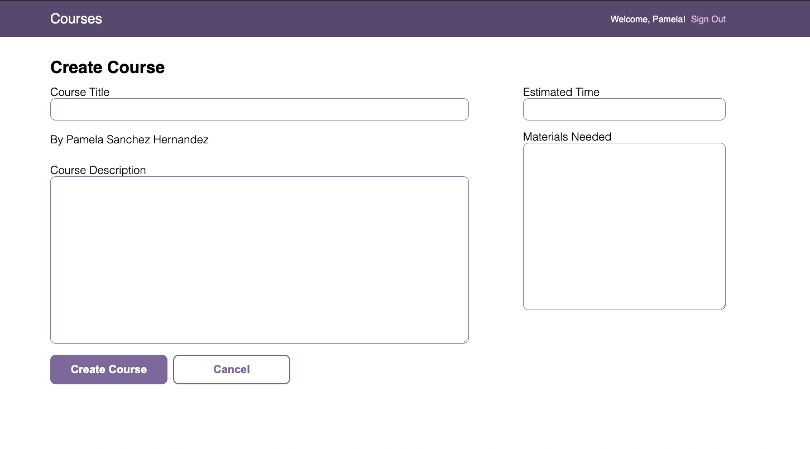
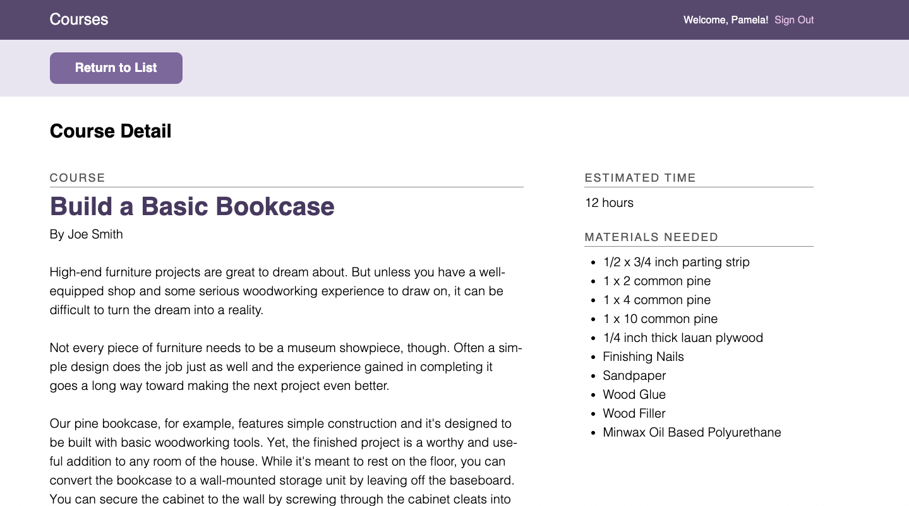
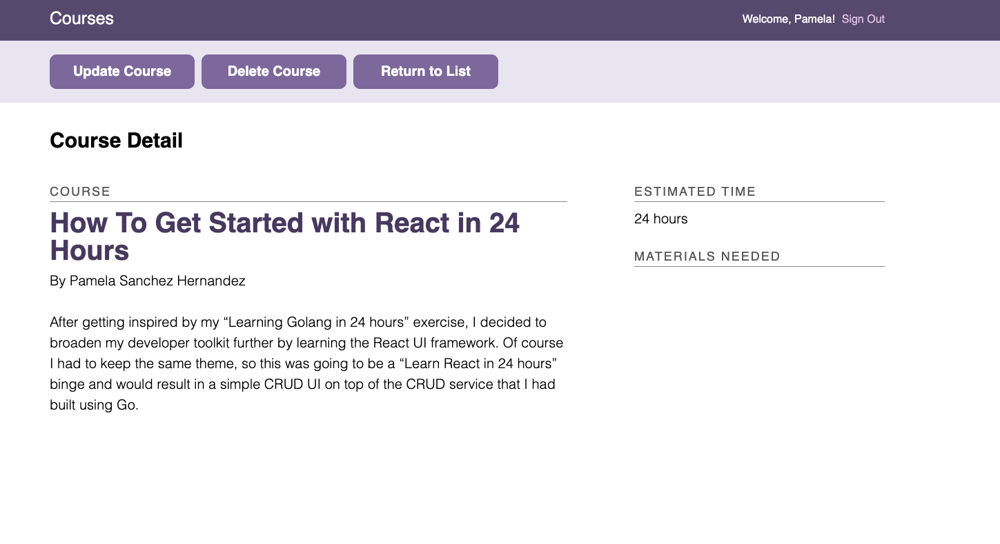

# Full Stack App with React and a REST API
This application provides a way for users to administer a school database containing information about courses.

&nbsp;

&nbsp;

# View Project
1. Download this repo.
2. Navigate to the project's api directory in the   command line/terminal.
3. Run 'npm install'.
4. Run 'npm run seed' to seed the SQLite database.
5. Run 'npm start' to start the REST API server.
6. Visit http://localhost:5000/ in your web browser to test the REST API.
7. Open a second terminal window.
7. Navigate to the project's client directory in the command line/terminal.
8. Run 'npm install'.
10. Run 'npm start' to start the react application.
11. Visit http://localhost:3000/ in your web browser to view the application.

&nbsp;

&nbsp;

# Project Objective
In this project, I created a full stack application that provides a way for users to administer a school database containing information about courses. Users can interact with the database by retrieving a list of courses, viewing details for a specific course, as well as creating, updating and deleting courses from the database. Users are required to create an account and log-in to make changes to the database.

The project uses a REST API that I created in a [previous project](https://github.com/Pamelachristina/rest_api).

&nbsp;

&nbsp;

# Techniques and Tools
+ Express.js - web application framework
+ Sequelize ORM - mapping between JavaScript objects and SQLite
+ DB Browser for SQLite - viewing SQLite database tables
+ Postman - REST API route testing
+ express-validator - database validation
+ bcryptjs - password hashing
+ basic-auth - parsing authorization header
+ cors - enable all CORS requests
+ React Context API - managing application's global state
+ react-router-dom - application routing
+ create-react-app - initial React project setup
+ react-markdown - rendering markdown formatted text
+ axios - Promise-based HTTP requests
